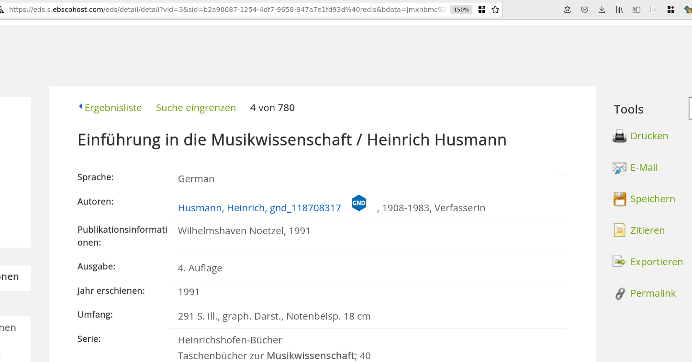
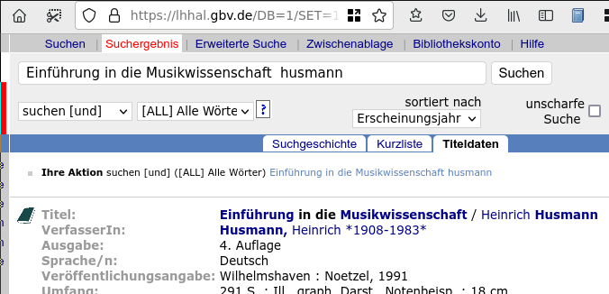

# Literatur hinzufügen

Zotero erleichtert das 'Einsammeln' von Literatur ungemein.
In einer Vielzahl von Bibliothekskatalogen, auf Verlagsplattformen,Literaturdatenbanken oder auch bei online-Buchhandlungen können Sie aus dem Browser heraus mit einem Klick die bibliographischen Angaben herunterladen.

## Hinzufügen über das Browser-Plugin

Dasselbe ist auch im Opac möglich:

Auch auf [Google Books](https://books.google.de) lassen sich Titel mit einem Klick importieren.

Neben 'Literatur' im eher konventionellen Sinn (Bücher, Aufsätze) verzeichnet Zotero auch Websites, Youtube-Videos, Blogeinträge und vieles mehr.

## Hinzufügen per Identifier

Es lassen sich aus Zotero heraus Titel [durch Eingabe verschiedner Identifiers](https://www.zotero.org/support/adding_items_to_zotero#add_item_by_identifier) (DOI, ISBN, PubMed IDs und [arXiv](https://arxiv.org/) IDs) halbautomatisch hinzufügen. 

Klicken Sie hierzu auf das Zauberstab-Symbol und geben Sie den Identifier ein.

Zotero versucht die entsprechenden bibliographischen Informationen aus verschiedenen Datenbanken zu importieren.

## Manuelle Eingabe von Titeln

Falls kein (halb-)automatischer Import möglich ist oder Sie aus anderen Gründen nicht auf Fremddaten zurückgreifen möchten, können Sie Titel auch manuell eingeben.
